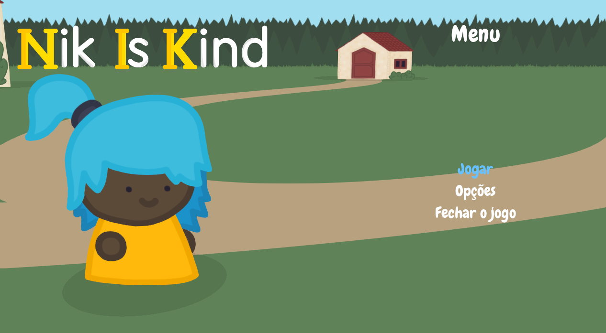
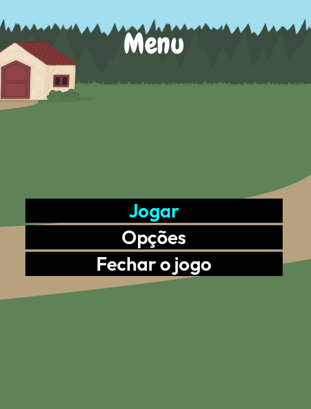

# Nik Is Kind
Um terrível vilão domina sua vila com sentimentos negativos e deixa todos os cidadãos vulneráveis!
Cabe a você salvar todos os membros da vila por meio de diversos _minigames_ e se fortalecer para vencer
o terrível vilão!

## Características Gerais
Plataforma: PC

## Menu Inicial

(Imagem do Menu Inicial, mostrando o título e alguns botões no jogo)

O menu acessível consiste em:
- Jogar
- Opções
    - Narração
    - Alto contraste
    - Filtros de daltonismo
- Sair

É possível ativar o modo de alto contraste, que facilita a leitura de informações importantes da tela.

(Menu com Alto Contraste. É possível notar que os botões, por exemplo, contam com um fundo escuro.)

## Créditos
Desenvolvido por [André Dias de Paula](https://github.com/Andreerdd), [Frederico Santos Gonçalves](https://github.com/TalkedSphere) e [Gabriel Della Gaspera](https://github.com/dellagaspera).
