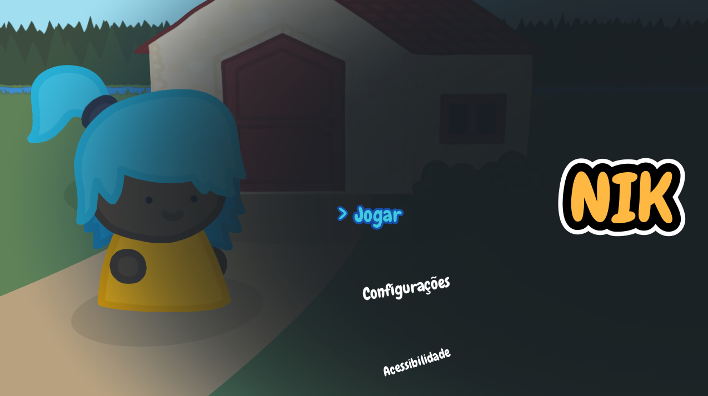
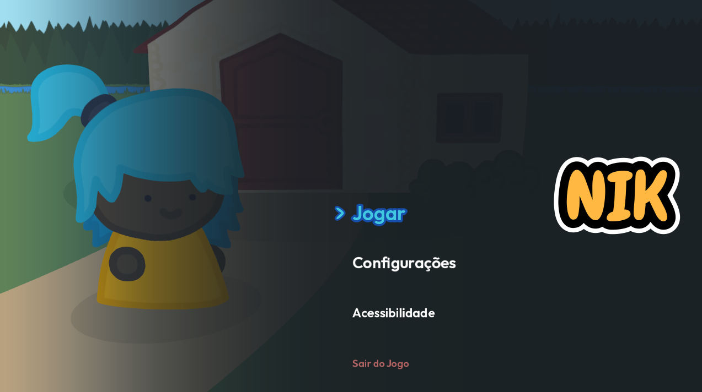

# Nik Is Kind
Um terrível vilão domina sua vila com sentimentos negativos e deixa todos os cidadãos vulneráveis!
Cabe a você salvar todos os membros da vila por meio de diversos _minigames_ e se fortalecer para vencer
o terrível vilão!

## Características Gerais
Plataforma: PC

## Menu Inicial

_(Imagem do Menu Inicial, mostrando o título e alguns botões no jogo)_

O menu acessível consiste em:
- Jogar
- Opções
    - Filtros de daltonismo
    - Redução de efeitos do menu
    - Fonte de fácil leitura
    - Edição de Controles
- Sair, que facilita a leitura de informações importantes da tela.

_(Menu no modo linear, com fonte mais fácil de ler.)_

## Créditos
Desenvolvido por:
- [André Dias de Paula](https://github.com/Andreerdd): Programação
- [Frederico Santos Gonçalves](https://github.com/TalkedSphere): Programação e Sprites
- [Gabriel Della Gaspera](https://github.com/dellagaspera): Programação e Sprites

Acesse os slides sobre o Menu _(Parte 1)_ [aqui](https://canva.link/0i8k9a8wbgczz79)
