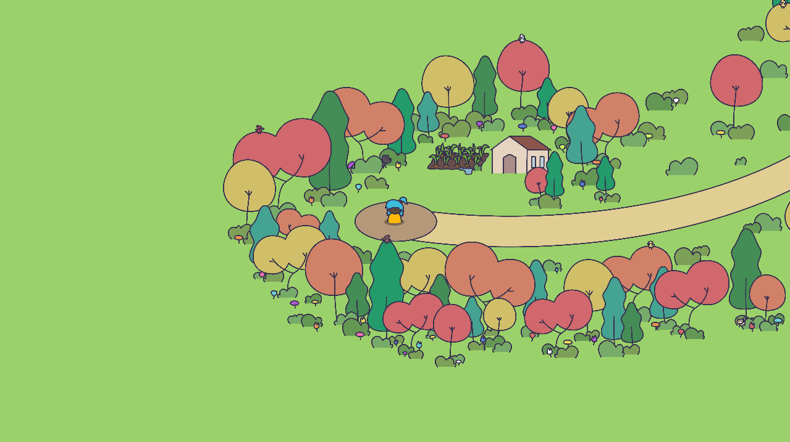
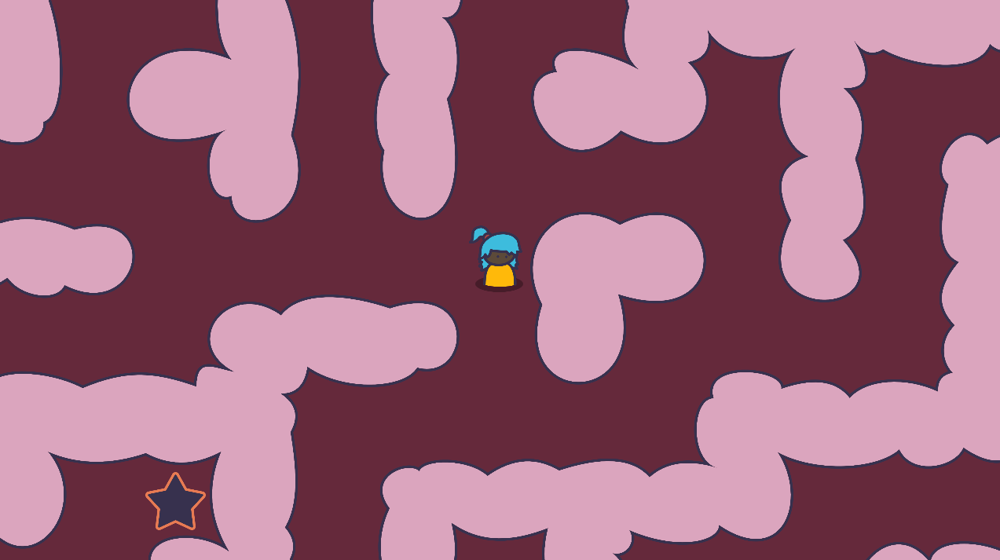
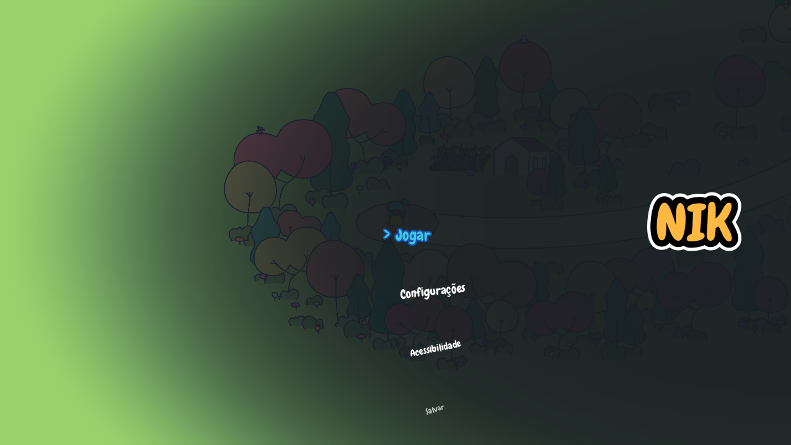
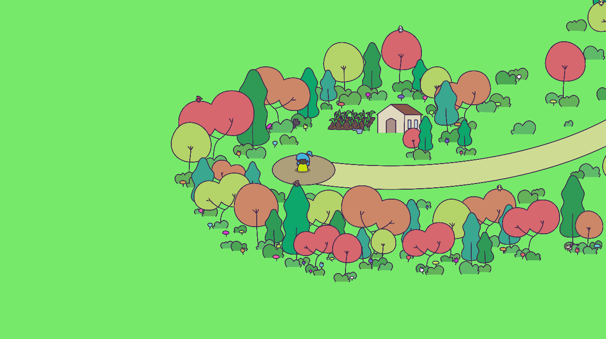
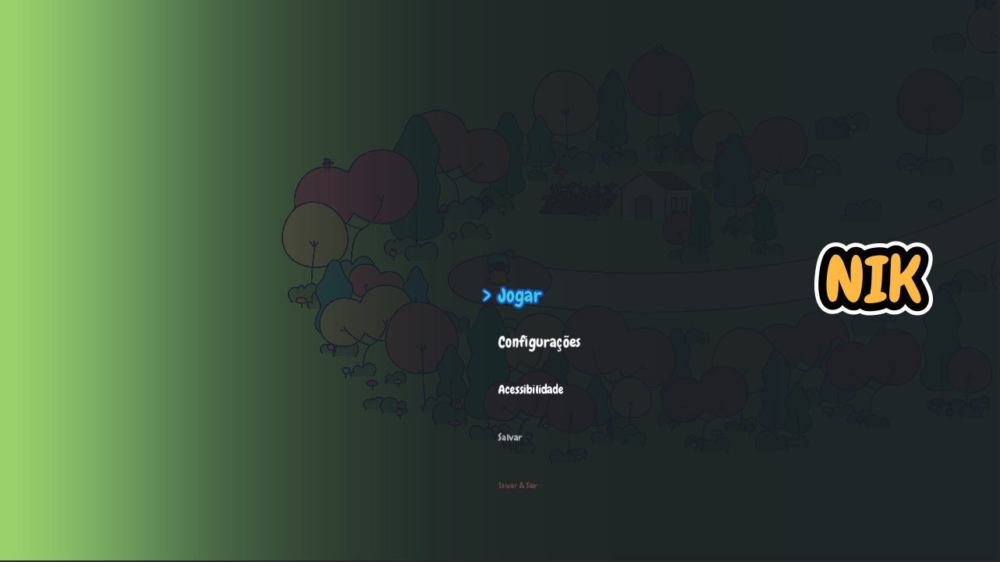
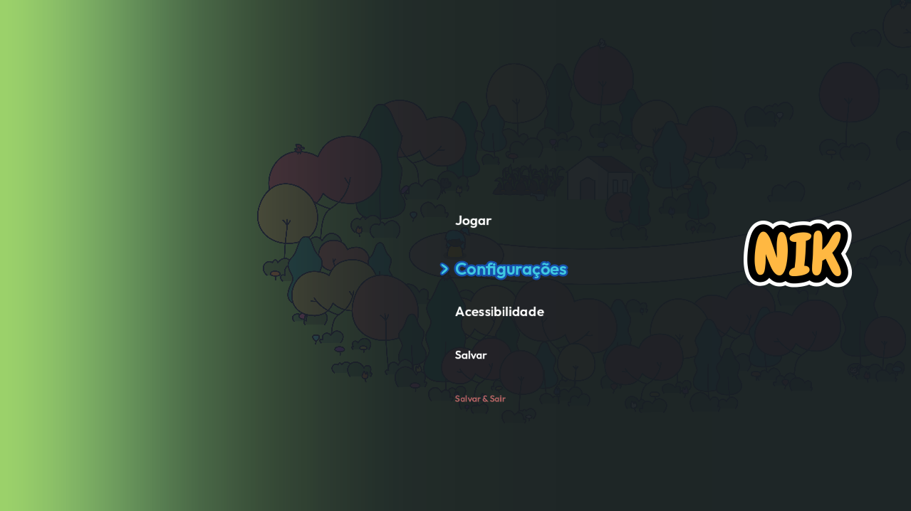
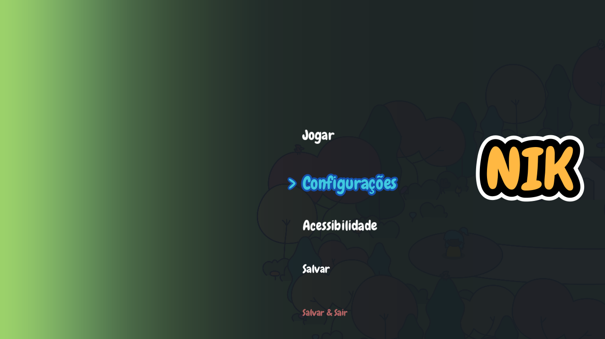
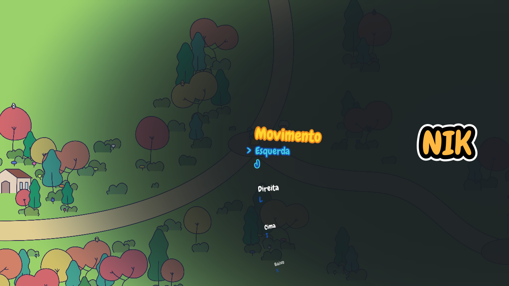

# Nik Is Kind
Um terrível vilão domina sua vila com sentimentos negativos e deixa todos os cidadãos vulneráveis!
Cabe a você salvar todos os membros da vila por meio de diversos _minigames_ e se fortalecer para vencer o terrível vilão!

Os _minigames_ do jogo são únicos! Seguem alguns exemplos de joguinhos que serão feitos pela protagonista:

## Características Gerais
Plataforma: PC

Entrada: Mouse e Teclado

Requisitos: Batata Cozida ou Purê de Batata em formato de dispositivo eletrônico

## Menu e Acessibilidade

O menu consiste em:
- Jogar
- Opções
    - Volume
    - Controles
- Acessibilidade
    - Filtros de daltonismo e sua respectiva intensidade

    - Redução de efeitos do menu

    - Fonte de fácil leitura

    - Escala da Interface

    - Edição de Controles

- Salvar
- Salvar & Sair

## Créditos
Desenvolvido por:
- [André Dias de Paula](https://github.com/Andreerdd): Programação e Música
- [Frederico Santos Gonçalves](https://github.com/TalkedSphere): Programação e Níveis
- [Gabriel Della Gaspera](https://github.com/dellagaspera): Programação, Sprites e Níveis

Agradecimento Especial:
- Virgínia: por nos guiar na produção do jogo =\)
- Você: por tomar seu tempo vendo nossa obra :D

Acesse os slides sobre o Menu _(Parte 1)_ [aqui](https://canva.link/0i8k9a8wbgczz79)
